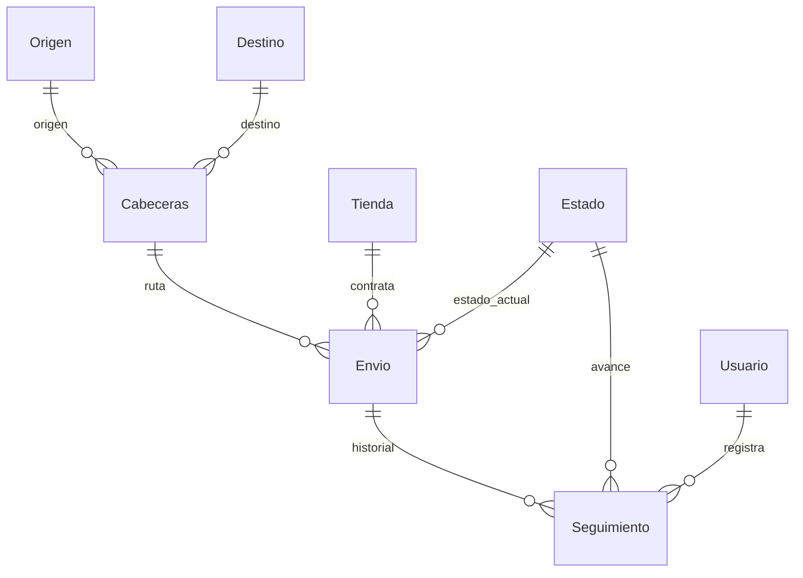

# Modelo del courier

Se usan las ocho tablas existentes compartidas por el usuario. No se recrean.
Solo se amplía `Usuario.Contraseña` a 255 caracteres para guardar el hash y se
exige que el nombre de usuario sea único. No se agrega una columna de rol:
el usuario con ID 0 es administrador, igual que en CC5.

- **Estado:** ID_estado, Orden, Nombre. IDs y orden del 1 al 5.
- **Usuario:** ID_usuario, Nombre, Usuario, Contraseña.
- **Origen / Destino:** ID, Ciudad, Cobertura (`SI` o `NO` en los formularios).
- **Tienda:** ID_tienda, No_orden, Nombre, Host.
- **Cabeceras:** ID_cabecera, costo_envio, costo_manejo, ID_origen, ID_destino.
- **Envio:** No_guia, Fecha, Hora, Costo_total, Destinatario, Fecha_entrega,
  ID_estado, ID_cabecera, ID_tienda.
- **Seguimiento:** ID_seguimiento, Observacion, Hora, Fecha, No_guia,
  ID_estado, ID_usuario.

El estado actual de Envio se actualiza junto con el nuevo Seguimiento en una
transacción. Al llegar al estado 5 se establece Fecha_entrega. Eliminar Envio
borra sus registros de Seguimiento por `ON DELETE CASCADE`.

La API está pendiente. Los IDs enteros actuales son internos; antes de conectar
tiendas externas se acordarán los códigos requeridos por el PDF y los campos
de dirección y orden por envío.
